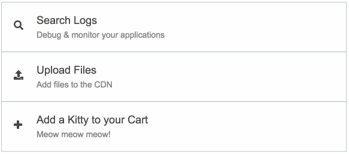

# Shiny Tiles ✨

Shiny Tiles is:
* is a lightweight (1.2 KB) CSS file
* plug-and-play
* compatible with modern browsers that support CSS3 (IE10+)
* customizble in any color!



## How to Use

**Step 1:** Add the `shiny-tile.css` to your page.

```html
<link rel="stylesheet" href="css/shiny-tile.css">
```

**Step 2:** Add the `shiny-tile` class wherever you want.

```html
<div class="shiny-tile"></div>
```

**Step 3 (optional):** You can use the provided content hierarchy. In this example, we use [Font-Awesome](https://fontawesome.com/) for the icon.

```html
<!-- Or use this template -->
<div class="shiny-tile">
    <a href="">
        <div class="shiny-tile-inner">
            <div class="shiny-tile-icon">
                <i class="fas fa-search"></i>
            </div>
            <div class="shiny-tile-desc">
                <div class="shiny-tile-title"></div>
                <div class="shiny-tile-subtitle"></div>
            </div>
        </div>
    </a>
</div>
```


## Behind the Scenes: CSS

Here's how Shiny Tiles is working behind the scenes.

```css
.shiny-tile {
    position: relative;
    z-index: 0;

    /* Keep the style inside the container */
    overflow: hidden;

    /* Give it some styling */
    border: 1px solid rgba(169, 178, 177, 0.7);
    margin-bottom: -1px;
    margin-right: -1px;
    padding-left: 15px;
    padding-right: 15px;

    transition: all 0.4s ease;
}

.shiny-tile:hover {
    /* Give the tile a "pop-out" effect */
    box-shadow: 0 8px 17px 0 rgba(0, 0, 0, 0.2), 0 6px 20px 0 rgba(0, 0, 0, 0.19);
}

.shiny-tile:after {
    position: absolute;
    /* Set :after as invisible element */
    content: '';
    width: 0;

    /* Flush with the container */
    left: 0;
    bottom: 0;

    /* Don't let it cover the content */
    z-index: -1;

    /* Choose any color */
    background: #f5f5f5;

    /* Angle the transition */
    transform: skewX(-45deg);

    transition: 0.4s;
}

.shiny-tile:hover:after {
    /* Expand the styling */
    left: -10%;
    width: 130%;
    height: 120%;
}
```
